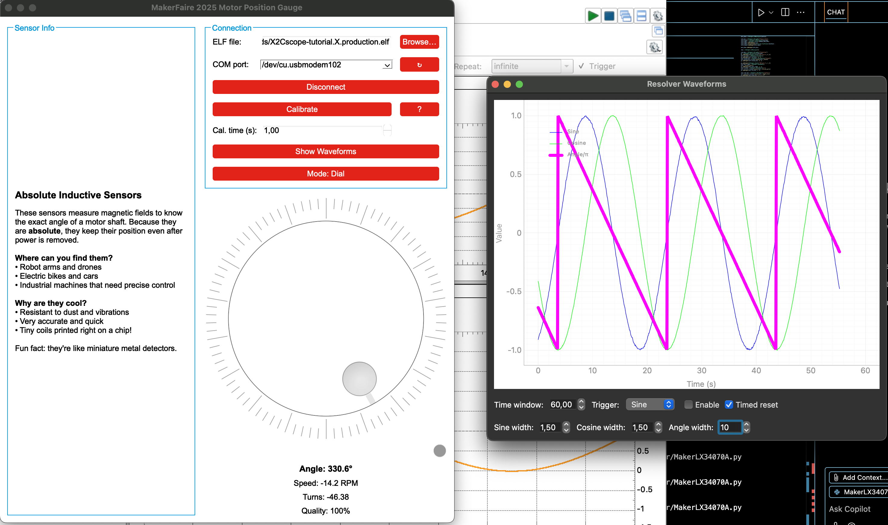
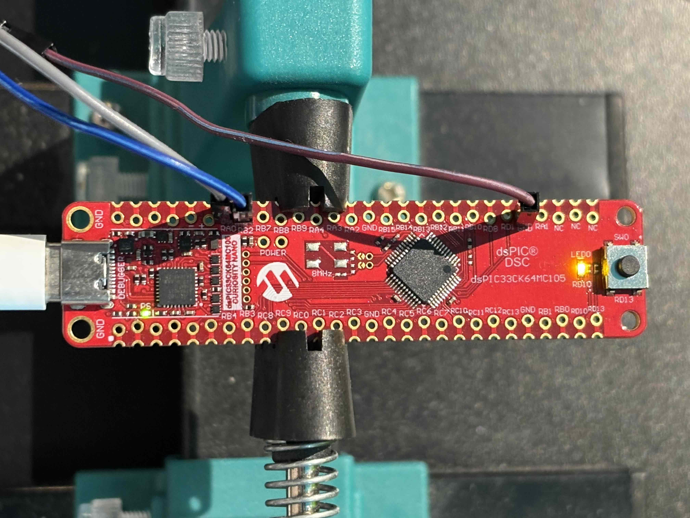

# MakerFaire LX34070A Demo 2025

**Last updated:** July 27, 2025

This repository showcases several demos built around the LX34070A inductive sensor. A cheap dsPIC33CK64MC105 Curiosity Nano Board was used to read the signal from the inductive sensor. Python GUIs connect to the dsPIC through [pyX2Cscope](https://github.com/X2Cscope/pyx2cscope) when available, but all programs also have a demo mode that simulates data so they can run standalone.





## Included Demos

- **`MotorGaugeDemo.py`** – PyQt6 application displaying the motor angle on multiple widgets. It can also plot sine and cosine waveforms and includes a calibration routine.
- **`KidMotorGaugeDemo.py`** – Simplified gauge designed for kids with a colourful dial and spinning star.
- **`InductiveSensorDemo.py`** – PyQt6 version of the resolver signal monitor built with `pyqtgraph`.
- **`InductiveSensorDemoTk.py`** – Tkinter variant of the resolver demo using `matplotlib` for plotting.
- **`MotorLogger.py`** – A feature-rich logger that can start/stop the motor, log up to five variables with per-channel scaling and export the data.
- **`main.c`** – Minimal firmware reading raw sine/cosine values and exposing them, along with the calculated position, via X2Cscope.

## Features

- Connects to an MCAF-compatible target running the LX34070A firmware
- Demo mode when `pyX2Cscope` is not installed
- Multiple visualization options: dial gauge, slider, bar, LCD, compass and more
- Resolver waveform plotting with triggers and calibration helper
- Motor logger supports 1 ms sampling using X2Cscope scope channels
- Optional channel scaling and export to CSV, Excel or MATLAB

## Requirements

- Python 3.11+
- [pyX2Cscope](https://pypi.org/project/pyx2cscope/)
- Optional packages: `pyqtgraph`, `PyQt6`, `matplotlib`, `pandas` and `scipy`
- A Microchip board with the LX34070A sensor (for hardware mode)
- A dsPIC33CK64MC105 Curiosity nano board

## Setup

1. Create and activate a virtual environment:
   ```bash
   python -m venv venv
   source venv/bin/activate  # on Windows use venv\Scripts\activate
   ```
2. Install the required package:
   ```bash
   pip install pyx2cscope
   ```
3. (Optional) Install plotting and GUI dependencies:
   ```bash
   pip install PyQt6 pyqtgraph matplotlib pandas scipy
   ```
4. Run any demo, for example the gauge:
   ```bash
   python MotorGaugeDemo.py
   ```

## Usage Overview

1. Select the ELF file built for your target and the COM port.
2. Click **Connect** to establish communication or run in Demo mode if no hardware is found.
3. For the gauge demos, use **Change View** to cycle through the different widgets.
4. In `MotorLogger.py`, set the desired speed, scaling factor and sample interval then press **START**. Use **STOP** to end the capture early, plot the results or save them to file.
5. `InductiveSensorDemo.py` and `InductiveSensorDemoTk.py` display sine and cosine signals along with the calculated angle. Both offer basic trigger options.
6. `main.c` shows how the MCU collects ADC samples, normalizes them and exposes variables to X2Cscope.

## How the Pieces Fit Together

The firmware periodically samples the resolver signals and computes the position using `atan2f`. These variables are exposed through X2Cscope so the Python GUIs can read them. The GUIs rely on a small wrapper class that hides the difference between real hardware and demo mode. Each demo updates its widgets every few milliseconds using `QTimer` or Tkinter's `after` callbacks. The logger additionally configures scope channels to capture all variables at a fixed rate and writes the scaled values to memory before optionally saving them.

## References

- [pyX2Cscope on GitHub](https://github.com/X2Cscope/pyx2cscope)
- [X2Cscope documentation](https://x2cscope.github.io/)

